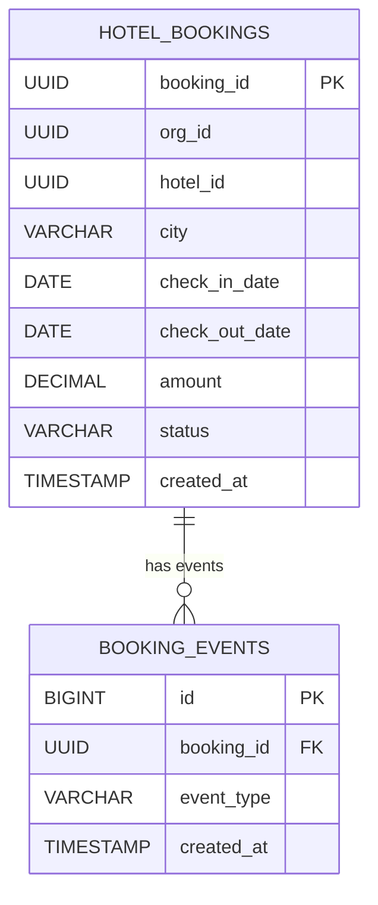

# Tripire DevOps Assessment


> Infrastructure as Code, PostgreSQL automation, query optimization and CI validation using Terraform and GitHub Actions.

## Overview

This repository contains my implementation of the Tripire DevOps Assessment. The goal of this project was not only to provision infrastructure and complete the required database tasks, but also to organize the solution in a way that is maintainable, reusable, and close to real-world DevOps practices.

The project includes:

- Modular Terraform infrastructure
- Separate Development and Production environments
- PostgreSQL schema, seed data and query optimization
- Backup and restore automation
- GitHub Actions for Terraform validation
- Docker Compose for local database development

---

## Design Principles

While implementing this assessment, I followed a few simple principles:

- Keep infrastructure modular instead of writing everything in one file.
- Separate environments without duplicating code.
- Automate repetitive tasks.
- Keep local development reproducible.
- Keep configuration readable and maintainable.
- Document production improvements even when they are outside the assessment scope.

---

# Repository Structure

```text
tripire-devops-assessment
├── .github/
│   └── workflows/
├── database/
│   ├── migrations/
│   ├── queries/
│   └── seeds/
├── infra/
│   ├── environments/
│   │   ├── dev/
│   │   └── prod/
│   └── modules/
│       ├── network/
│       ├── security/
│       ├── alb/
│       ├── ecs/
│       └── rds/
├── scripts/
├── docker-compose.yml
└── README.md
```

---

# Architecture

```text
                 Internet
                     │
        ┌────────────────────────┐
        │ Application LoadBalancer│
        └────────────────────────┘
                     │
              ECS Application
                     │
        ┌────────────────────────┐
        │   PostgreSQL Database  │
        └────────────────────────┘
```

## Why this architecture?

Instead of placing all resources into a single Terraform configuration, the infrastructure is divided into reusable modules. This keeps the code easier to maintain, test, and extend while allowing the same modules to be reused by multiple environments.

---

# Terraform

## Modules

### Network
Creates:
- VPC
- Public subnets
- Private subnets
- Internet Gateway
- Route Tables

**Why?**

Networking usually changes less frequently than application resources. Keeping it isolated makes future changes easier without affecting the rest of the infrastructure.

### Security

Creates dedicated Security Groups for:

- ALB
- ECS
- RDS

This follows the principle of least privilege by allowing only the required communication between components.

### ALB

Creates:

- Application Load Balancer
- Target Group
- Listener

Separating load balancing from compute makes the module reusable for future services.

### ECS

Contains the application layer configuration.

Keeping compute resources separate from networking improves maintainability.

### RDS

Creates:

- PostgreSQL Instance
- Database subnet group
- Supporting configuration

The database module remains independent so storage or instance changes can be performed without modifying networking resources.

---

# Environment Separation

Two independent environments are provided.

```text
infra/environments/dev
infra/environments/prod
```

Both environments reuse the same modules but use different configuration values.

Development focuses on rapid testing.

Production uses safer defaults such as deletion protection and longer backup retention.

---

# Database

The project uses PostgreSQL running locally through Docker Compose.

```bash
docker compose up -d
```

Using Docker allows anyone reviewing the project to start the database without installing PostgreSQL directly on the host system.

## Database Schema

The solution contains:

<<<<<<< HEAD
- Hotel Bookings
- Booking Events
=======
## Entity Relationship Diagram



## hotel_bookings
>>>>>>> 6784de9 (Add documentation screenshots and update README)

Booking events are stored separately from booking records to represent lifecycle events while maintaining a normalized schema.

---

# Seed Data

The repository includes SQL scripts to populate sample data for testing and query analysis.

This makes query optimization reproducible for anyone reviewing the assessment.

---

# Query Optimization

Indexes are created to improve filtering performance.

`EXPLAIN ANALYZE` is used to verify execution plans and demonstrate the impact of indexing.

---

# Backup & Restore

Two scripts are included.

## Backup

```bash
./scripts/backup.sh
```

Creates a timestamped database backup.

## Restore

```bash
./scripts/restore.sh backups/<backup-file>.sql
```

The restore script recreates the schema before importing the backup to avoid duplicate object errors.

---

# GitHub Actions

The repository includes a Terraform validation workflow.

Pipeline:

- Terraform Format Check
- Terraform Init
- Terraform Validate
- Terraform Plan

The workflow executes for both Development and Production environments.

The purpose of the workflow is to detect formatting, syntax and planning issues before infrastructure changes are merged.

---

# Security Considerations

For the purpose of this assessment, placeholder values are used inside `terraform.tfvars`.

In a production environment I would instead use:

- AWS Secrets Manager
- IAM Roles
- GitHub Actions Secrets
- Remote Terraform State (S3 + DynamoDB)

---

# Assumptions

To keep the implementation focused on the assessment:

- Local Terraform backend
- Dockerized PostgreSQL
- Single AWS region
- Single database instance
- No application deployment

---

# Future Improvements

If this project evolved into a production environment, I would add:

- Remote Terraform Backend (S3 + DynamoDB)
- AWS Secrets Manager
- Multi-AZ RDS
- ECS Auto Scaling
- Route53
- ACM Certificates
- AWS WAF
- CloudWatch Monitoring
- Centralized Logging
- Terraform Security Scanning (Checkov / tfsec)
- Cost estimation using Infracost

---

# Running the Project

## Start PostgreSQL

```bash
docker compose up -d
```

## Run Migrations

```bash
docker exec -i tripire-postgres psql -U postgres -d hoteldb < database/migrations/001_create_tables.sql
```

## Seed Data

```bash
docker exec -i tripire-postgres psql -U postgres -d hoteldb < database/seeds/001_seed_data.sql
docker exec -i tripire-postgres psql -U postgres -d hoteldb < database/seeds/002_seed_booking_events.sql
```

## Create Indexes

```bash
docker exec -i tripire-postgres psql -U postgres -d hoteldb < database/queries/001_create_indexes.sql
```

## Run Optimization Query

```bash
docker exec -i tripire-postgres psql -U postgres -d hoteldb < database/queries/002_query_optimization.sql
```

## Backup

```bash
./scripts/backup.sh
```

## Restore

```bash
./scripts/restore.sh backups/<backup-file>.sql
```

## Terraform

Development

```bash
cd infra/environments/dev
terraform init
terraform validate
terraform plan
```

Production

```bash
cd infra/environments/prod
terraform init
terraform validate
terraform plan
```

---

# Verification

The repository has been verified with:

- Successful Terraform validation
- Successful Terraform plan
- Passing GitHub Actions workflow
- Database migrations
- Seed data
- Backup and restore
- Query optimization

---

# Final Notes

The primary objective of this assessment was to demonstrate clean infrastructure organization, automation and maintainability rather than build a feature-complete production platform.

Where appropriate, I intentionally kept the implementation simple while documenting the production-grade improvements I would introduce in a real-world environment.
